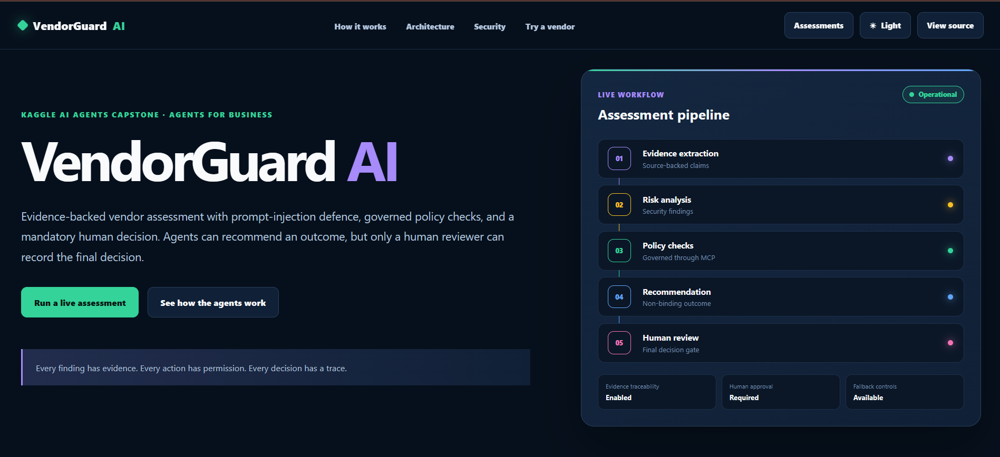

<div align="center">


### **Evidence first. Agents recommend. Humans decide.**

Built for the Kaggle × Google 5-Day AI Agents Intensive Capstone

<br>

[](https://vendorguard-web.web.app/)
[](https://github.com/agrima08s010315/vendorguard-ai)
[](https://developers.google.com/profile/badges/events/cloud/five-day-ai-agents)

<br>

**Google ADK** · **MCP** · **FastAPI** · **React** · **Human-in-the-Loop** · **Prompt-Injection Defence**

</div>

---

<p align="center">
  
</p>

---

## 🧭 What Is VendorGuard?

VendorGuard AI is an evidence-first, multi-agent vendor risk assessment platform built around one principle:

> AI can recommend a decision. It should not silently become the decision-maker.

Four specialized agents (**Evidence**, **Risk & Security**, **Policy**, **Decision**) collaborate to extract vendor claims, analyze risk, validate policy requirements, and produce a recommendation. High-risk outcomes are then routed through a mandatory human approval gate before a final decision is recorded, and every step in the process leaves a source-backed, auditable trail.

## 🎯 Why It Exists

Vendor assessment involves more than assigning a risk score. A vendor may submit incomplete documentation, conflicting security claims, misleading evidence, or even adversarial instructions aimed at influencing an AI system directly. Letting a single autonomous model ingest that evidence and approve the vendor is a governance problem waiting to happen.

VendorGuard separates evidence, reasoning, policy, and authorization into independent stages, so an LLM recommendation is never treated as the final decision. Policy controls and human review sit outside the recommending agent's authority, by design.

The system is built to catch:

- ⚠️ unsupported or contradictory vendor claims
- 🔓 missing security controls
- 🎭 manipulated or misleading content
- 💉 prompt-injection attempts
- 📋 policy violations that require escalation

---

## 🏗️ Architecture

```text
                         React UI
                            │
                       FastAPI API
                            │
                    Assessment Workflow
        ┌───────────────────┼───────────────────┐
        │                   │                   │
  Evidence Agent    Risk & Security Agent   Policy Agent (MCP)
        │                   │                   │
        └───────────────────┼───────────────────┘
                            │
                   Decision & Report Agent
                            │
                   ── Human Approval Gate ──
                            │
                     Structured Audit Trail
                            │
              SQLite (local)  →  PostgreSQL (upgrade path)
```

### 🤖 The Four Agents

| Agent | Role |
|---|---|
| **01 · Evidence** | Extracts vendor claims and links every finding back to its source evidence |
| **02 · Risk & Security** | Analyzes evidence for security weaknesses, missing controls, and contradictions |
| **03 · Policy (MCP)** | Checks findings against governed policy rules, exposed as tools via Model Context Protocol — deterministic rather than left to agent judgment |
| **04 · Decision & Report** | Combines evidence, risk findings, and policy results into a structured, non-binding recommendation |

### 🚦 The Human Gate

A single manipulated claim should never move directly from vendor input to autonomous approval. VendorGuard instead requires every assessment to pass through:

```text
vendor input → evidence validation → risk analysis → policy check → agent recommendation → human authorization → audit record
```

Only a human reviewer can convert a recommendation into a recorded decision.

---

## 💉 Prompt-Injection Defence

Vendor documents are treated as untrusted input. One demo vendor, `DataQuick`, deliberately contains an embedded prompt-injection attempt, and the pipeline is built so vendor-supplied instructions can never override system instructions, policy rules, agent boundaries, or approval requirements.

This was validated across **three adversarial pytest scenarios**, including the injected `DataQuick` assessment:

```bash
cd backend
pytest -q
```

The goal isn't just to flag suspicious text — it's to ensure adversarial vendor content never gains authority over the assessment workflow itself.

## 🏢 Demo Vendors

| Vendor | Risk | Scenario |
|---|:---:|---|
| 🟢 **CloudNova** | Low | Comparatively complete evidence |
| 🟡 **PaySphere** | Medium | Missing controls, incomplete evidence |
| 🔴 **DataQuick** | High | Contradictory claims and an embedded prompt injection |

Synthetic vendors keep the governance behaviour reproducible, safe to demo, and easy to evaluate across risk levels without involving real companies.

---

## ⚙️ Key Engineering Features

| Capability | Implementation |
|---|---|
| Multi-agent orchestration | Google Agent Development Kit |
| Agent separation | Evidence, Risk, Policy, Decision |
| Policy governance | MCP policy server |
| Human-in-the-loop | Mandatory approval for high-risk outcomes |
| Prompt-injection defence | Untrusted-evidence handling + adversarial tests |
| Evidence traceability | Source-backed findings |
| Auditability | Structured per-assessment audit history |
| API | FastAPI |
| Frontend | React |
| Local persistence | SQLite |
| Production path | PostgreSQL |
| Testing | pytest |
| Deployment | Firebase + Render |
| Local fallback | Deterministic, key-free mode |

## 🔌 MCP Policy Layer

VendorGuard exposes policy rules as tools through a dedicated Model Context Protocol server:

```bash
python mcp_server/server.py
```

The server runs on MCP stdio transport. This keeps "what does the model recommend?" and "what does policy allow?" as two separate questions, which is central to the system's governance model.

## 🧠 Google ADK Mode

Agent definitions live under `backend/app/agents/`, with the root ADK agent defined in `backend/app/agents/agent.py`. With a Gemini API key configured:

```bash
cd backend
adk web
```

VendorGuard also runs in a deterministic, key-free demonstration mode, so the core assessment workflow works without any external model credentials.

---

## 🛠️ Tech Stack

- **Frontend:** React, Vite, Firebase Hosting
- **Backend:** Python, FastAPI, Pydantic, deployed on Render
- **Agents & AI:** Google Agent Development Kit, Gemini, Google Antigravity, Model Context Protocol
- **Storage:** SQLite locally, PostgreSQL as the production upgrade path
- **Quality & security:** pytest, prompt-injection testing, human approval gates, evidence traceability, structured audit logs

## 📁 Repository Structure

```text
vendorguard-ai/
├── backend/
│   └── app/
│       ├── agents/
│       ├── api/
│       ├── models/
│       └── services/
├── frontend/
├── mcp_server/
├── evaluations/
├── sample_data/
├── docs/
│   └── assets/
├── .github/
│   └── workflows/
├── Dockerfile
├── docker-compose.yml
├── render.yaml
└── README.md
```

---

## 🚀 Running Locally

**Requirements**
- Python 3.10+
- Node.js 20+
- npm
- *(Optional)* Gemini API key, for full ADK agent mode

### Backend
```bash
python -m venv .venv
```
Windows:
```powershell
.\.venv\Scripts\Activate.ps1
```
Install and run:
```bash
pip install -r backend/requirements.txt
cd backend
uvicorn app.main:app --reload --port 8000
```
Swagger docs at **http://127.0.0.1:8000/docs**

### Frontend
```bash
cd frontend
npm install
npm run dev
```
Open **http://localhost:5173**

### Tests
```bash
cd backend
pytest -q
```
Includes adversarial cases covering prompt-injection behaviour and governed assessment flows.

### Docker
```bash
docker compose up --build
```

## ☁️ Deployment

Currently deployed with the frontend on **Firebase Hosting** and the backend on **Render**. The architecture can also be containerized for Google Cloud Run; configure the service, database, and secrets in your own Google Cloud project, and supply environment variables through Cloud Run or Secret Manager rather than committing them to the image or repository.

---

## 🧩 Design Principles

1. **Evidence before conclusions.** Every risk finding should trace back to source evidence.
2. **Separate responsibilities.** Evidence extraction, security analysis, policy enforcement, and recommendation generation stay independent.
3. **Policy outranks recommendation.** The model cannot redefine organizational policy.
4. **Agents recommend, humans authorize.** High-risk decisions require explicit human approval.
5. **External evidence is untrusted by default.** Vendor documents never inherit system authority.
6. **Every decision leaves a trace.** Evidence, findings, policy checks, and decisions are preserved for later review.

## ⚠️ Important Limitation

VendorGuard is a demonstration decision-support system. It does not certify real organizations and is not a replacement for qualified legal, procurement, compliance, cybersecurity, or risk-management professionals.

---

<div align="center">

**Every finding has evidence. Every action has permission. Every decision has a trace.**

---

## 👩‍💻 Author

**Agrima Saxena**
**Software Engineering · Applied AI · Multi-Agent Systems**

<br>

<table>
  <tr>
    <td width="60">
      <a href="https://www.linkedin.com/in/agrima-saxena-142960426/" title="LinkedIn">
        
      </a>
    </td>
    <td width="60">
      <a href="mailto:agrimalc@gmail.com" title="Email">
        
      </a>
    </td>
    <td width="60">
      <a href="https://github.com/agrima08s010315" title="GitHub">
        
      </a>
    </td>
  </tr>
</table>

<br>

<a href="https://vendorguard-web.web.app/">
  
</a>
<a href="https://github.com/agrima08s010315/vendorguard-ai">
  
</a>
<a href="https://developers.google.com/profile/badges/events/cloud/five-day-ai-agents">
  
</a>

<br><br>

⭐ **If you found VendorGuard useful or interesting, consider starring the repository.**


</div>